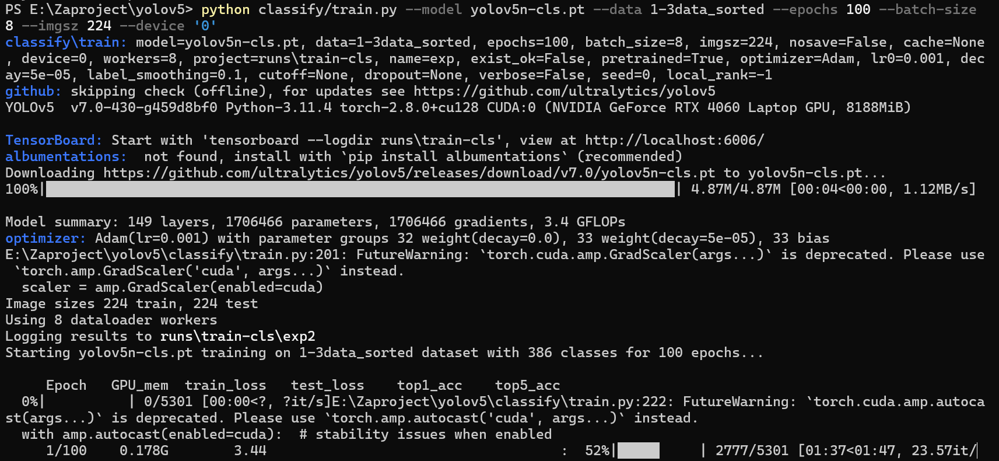
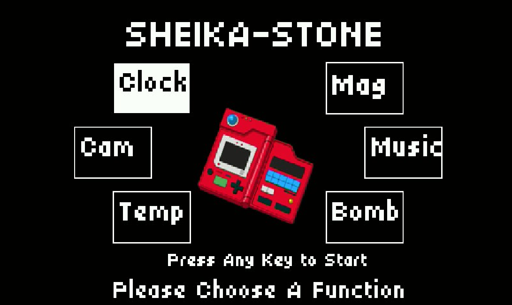

# Nautilus-Prime

> 项目采用K230-CanMV开发板提供主要算力

## 项目构思

因大作业要求需要使用自己焊的STC-B板，需要想一种方法使得STC-B与K230有机结合

### STC-B模块

1. 系统函数库Sys.Lib
2. 显示模块函数库Displayer.lib
3. 按键模块函数库Key.lib
4. 无源蜂鸣器函数库Beep.lib
5. 音乐模块函数库Music.lib
6. 霍尔传感器模块函数库Hall.lib
7. 振动传感器模块函数库Vib.lib
8. 模数转换模块函数库ADC.lib
9. 异步通信模块函数库Uart1.lib

10.异步通信模块函数库Uart2.lib

11.红外模块函数库IR.lib

12.步进电机控制模块函数库StepMotor.lib

13.实时时钟模块函数库DS1302.lib

14.非易失性存储器模块函数库M24C02.lib

15.FM收音机模块函数库FM_Radio.lib

16.EXT模块函数库（电子秤、超声波测距、编码器、PWM）EXT.lib

### K230模块

通过对比，STC-B可有部分参与感的功能：

- 按键结合串口通信：有线和红外
- 霍尔
- 振动传感


K230需要实现：

- 触摸功能+UI

- 外接喇叭播放音频
- LCD图像输出
- 无线网络模块
- AI推理图像
- PWM调节亮度

### 其它模块

另有

- LM386音频放大模块
- 5向开关
- 喇叭
- 一堆杜邦线

## 项目

> 需要根据PCB联系厂家定制外壳，但由于时间紧迫，暂且搁置

### 希卡之石

> 灵感来自*塞尔达 旷野之息*

完全体希卡之石有着以下功能：

- 磁铁
  - 霍尔模块探测
- 炸弹
  - 动态图像+声音

- 制冰器
  - 温度显示

- 静止器
  - 锁屏？
- 相机
  - 核心模块，结合图像识别训练
- 大师摩托Zero
  - 。。。。。。
- 传导认证信息
  - +NFC模块实现门禁功能(开神庙这一块)

### 宝可梦图鉴

> 灵感来自*宝可梦系列*

- 图鉴
  - 图像训练以及拍摄显示模块
- 宝可梦捕捉
  - 建立用户个人数据保存

### 战备呼叫器

> 灵感来自 *绝地潜兵2*

需要用到触摸和媒体模块，但由于动态图像数据有限，可能只有几个典型战备

如:arrow_up::arrow_right::arrow_down::arrow_down::arrow_down:

结合以上所有构思，想要实现的第一步则是：开发一套简单的UI

## LVGL

> 本项目的GUI设计采用LVGL

LVGL（Light and Versatile Graphics Library，轻量级通用图形库）是一款开源的嵌入式图形用户界面（GUI）库，专为资源受限的嵌入式设备（如单片机、嵌入式处理器、物联网设备等）设计，具有轻量、高效、可定制性强等特点，被广泛应用于智能手表、家电控制面板、工业显示器、医疗设备等场景。

对能正常运行的示例代码进行分析，首先了解控件初始化函数

```
def user_gui_init():
    # 资源文件路径（SD 卡中存储字体、图片的目录）
    res_path = "/sdcard/examples/15-LVGL/data/"

    # 1. 加载 TrueType 中文字体（支持中文显示）
    # 参数：字体文件路径、字体大小（20 像素）、字符编码范围（0=默认全支持）
    chinese_font = lv.freetype_font_create("/sdcard/res/font/SourceHanSansSC-Normal-Min.ttf", 20, 0)
    if not chinese_font:
        raise Exception("Failed to load fonts")  # 字体加载失败则抛异常

    # 2. 创建英文文本标签（顶部居中）
    ltr_label = lv.label(lv.scr_act())  # 在当前屏幕（scr_act()）创建标签
    ltr_label.set_text("In modern terminology...")  # 设置文本内容
    ltr_label.set_style_text_font(chinese_font, 0)  # 应用中文字体（也支持英文）
    ltr_label.set_width(400)  # 标签宽度（超出部分自动换行）
    ltr_label.align(lv.ALIGN.TOP_MID, 0, 0)  # 对齐方式：顶部居中，偏移 (0,0)

    # 3. 创建中文文本标签（底部居中）
    cz_label = lv.label(lv.scr_act())
    cz_label.set_style_text_font(chinese_font, 0)  # 应用中文字体
    cz_label.set_text("嵌入式系统（Embedded System）...")  # 支持换行符 \n
    cz_label.set_width(400)
    cz_label.align(lv.ALIGN.BOTTOM_MID, 0, 0)  # 底部居中

    # 4. 加载动画图片（3 张 PNG 帧，循环播放）
    anim_imgs = [None]*4  # 动画帧数组（第 4 位复用第 0 帧，确保循环流畅）
    # 加载第 1 帧图片
    with open(res_path + 'img/animimg001.png','rb') as f:
        anim001_data = f.read()
    anim_imgs[0] = lv.img_dsc_t({  # 构建 LVGL 图片描述符
        'data_size': len(anim001_data),  # 图片数据长度
        'data': anim001_data             # 图片二进制数据
    })
    anim_imgs[-1] = anim_imgs[0]  # 第 4 帧 = 第 0 帧（循环过渡）
    # 加载第 2 帧（逻辑同上）
    with open(res_path + 'img/animimg002.png','rb') as f:
        anim002_data = f.read()
    anim_imgs[1] = lv.img_dsc_t({'data_size': len(anim002_data), 'data': anim002_data})
    # 加载第 3 帧（逻辑同上）
    with open(res_path + 'img/animimg003.png','rb') as f:
        anim003_data = f.read()
    anim_imgs[2] = lv.img_dsc_t({'data_size': len(anim003_data), 'data': anim003_data})

    # 创建动画图片控件（屏幕居中）
    animimg0 = lv.animimg(lv.scr_act())
    animimg0.center()  # 居中显示
    animimg0.set_src(anim_imgs, 4)  # 设置动画帧（4 帧）
    animimg0.set_duration(2000)  # 每帧播放时长（2000ms = 2 秒）
    animimg0.set_repeat_count(lv.ANIM_REPEAT_INFINITE)  # 无限循环
    animimg0.start()  # 启动动画

    # 5. 创建交互按钮（屏幕下方居中）
    btn = lv.btn(lv.scr_act())  # 创建按钮
    # 按钮对齐：屏幕居中，向下偏移 25% 屏幕高度（lv.pct(25) 表示百分比）
    btn.align(lv.ALIGN.CENTER, 0, lv.pct(25))
    label = lv.label(btn)  # 在按钮上创建标签
    label.set_text('on')  # 初始文本
    btn.set_user_data(label)  # 绑定标签为按钮的用户数据
    # 绑定点击事件：当按钮被点击时，调用 btn_clicked_event
    btn.add_event(btn_clicked_event, lv.EVENT.CLICKED, None)
```

创建开关组件+事件

```
    ui_Switch1 = lv.switch(lv.scr_act())
    ui_Switch1.set_width(500)
    ui_Switch1.set_height(250)
    ui_Switch1.set_align( lv.ALIGN.CENTER)
```

之后根据需要编写事件函数

```
def btn_clicked_event(event):
    # 将事件目标转换为 LVGL 按钮对象
    btn = lv.btn.__cast__(event.get_target())
    # 获取按钮关联的用户数据（此处为按钮上的标签）
    label = lv.label.__cast__(btn.get_user_data())
    # 切换标签文本（on ↔ off）
    if "on" == label.get_text():
        label.set_text("off")
    else:
        label.set_text("on")
```

最后从头进行初始化，搭建一个简单的初始UI界面

```
from media.display import *       # K230 显示驱动库（控制 LCD/HDMI）
from media.media import *         # K230 媒体管理库（管理显示缓冲区等资源）
import time, os, sys, gc          # 系统工具库（时间、文件、内存回收）
import lvgl as lv                 # 嵌入式 GUI 库（LVGL，负责 UI 渲染与交互）
from machine import TOUCH         # K230 触摸设备驱动（读取触摸坐标）

# 显示分辨率配置（宽度对齐到 16 的倍数，符合 LVGL 缓冲区要求）
DISPLAY_WIDTH = ALIGN_UP(800, 16)  # 800 对齐后仍为 800（800 % 16 = 0）
DISPLAY_HEIGHT = 480               # 固定高度 480

def display_init():
    # 初始化显示：使用 ST7701 控制器（TFT LCD 常用芯片），分辨率 800x480，开启 IDE 显示调试
    Display.init(Display.ST7701, width = 800, height = 480, to_ide = True)
    # 初始化媒体管理器（负责分配/管理显示缓冲区等媒体资源）
    MediaManager.init()

def display_deinit():
    os.exitpoint(os.EXITPOINT_ENABLE_SLEEP)  # 启用系统休眠出口点
    time.sleep_ms(50)                        # 延迟 50ms 等待资源释放
    Display.deinit()                         # 关闭显示驱动
    MediaManager.deinit()                    # 释放媒体资源（缓冲区等）
```

```
def disp_drv_flush_cb(disp_drv, area, color):
    	global disp_img1, disp_img2  # 引用全局双缓冲区

    # 当 LVGL 完成一帧渲染（flush_is_last() 为 True）
    if disp_drv.flush_is_last() == True:
        # 判断当前渲染的缓冲区是 disp_img1 还是 disp_img2
        if disp_img1.virtaddr() == uctypes.addressof(color.__dereference__()):
            Display.show_image(disp_img1)  # 显示缓冲区 1
            print(f"disp disp_img1 {disp_img1}")
        else:
            Display.show_image(disp_img2)  # 显示缓冲区 2
            print(f"disp disp_img2 {disp_img2}")
        time.sleep(0.01)  # 轻微延迟，避免显示抖动

    disp_drv.flush_ready()  # 通知 LVGL：当前区域刷新完成，可继续渲染
```

```
class touch_screen():
    def __init__(self):
        self.state = lv.INDEV_STATE.RELEASED  # 初始触摸状态：释放

        # 创建 LVGL 输入设备（类型为 POINTER，对应触摸/鼠标）
        self.indev_drv = lv.indev_create()
        self.indev_drv.set_type(lv.INDEV_TYPE.POINTER)
        self.indev_drv.set_read_cb(self.callback)  # 绑定触摸读取回调
        self.touch = TOUCH(0)  # 初始化 K230 第 0 号触摸设备

    def callback(self, driver, data):
        # 初始化坐标和状态（默认释放）
        x, y, state = 0, 0, lv.INDEV_STATE.RELEASED
        # 读取触摸数据（参数 1 表示最多读取 1 个触摸点）
        tp = self.touch.read(1)
        if len(tp):  # 若读取到有效触摸数据
            x, y, event = tp[0].x, tp[0].y, tp[0].event
            # 触摸事件：2（按下）或 3（持续按下）时，状态设为 PRESSED
            if event == 2 or event == 3:
                state = lv.INDEV_STATE.PRESSED
        # 将触摸数据传递给 LVGL
        data.point = lv.point_t({'x': x, 'y': y})  # 坐标
        data.state = state                         # 触摸状态
        
        def lvgl_init():
    global disp_img1, disp_img2  # 全局双缓冲区

    lv.init()  # 初始化 LVGL 库
    # 初始化 FreeType 字体渲染（支持 TrueType 字体，解决中文显示）
    # 参数：1=启用缓存，0=缓存大小（默认），65535=最大字符编码（支持中文）
    lv.freetype_init(1, 0, 65535)
    
    # 创建 LVGL 显示驱动（指定显示分辨率）
    disp_drv = lv.disp_create(DISPLAY_WIDTH, DISPLAY_HEIGHT)
    disp_drv.set_flush_cb(disp_drv_flush_cb)  # 绑定显示刷新回调
    
    # 创建双缓冲区（格式 BGRA8888：每个像素 4 字节，包含蓝、绿、红、透明度）
    disp_img1 = image.Image(DISPLAY_WIDTH, DISPLAY_HEIGHT, image.BGRA8888)
    disp_img2 = image.Image(DISPLAY_WIDTH, DISPLAY_HEIGHT, image.BGRA8888)
    
    # 配置 LVGL 绘制缓冲区：前台缓冲、后台缓冲、缓冲大小、渲染模式
    disp_drv.set_draw_buffers(
        disp_img1.bytearray(),  # 前台缓冲区（当前显示）
        disp_img2.bytearray(),  # 后台缓冲区（正在渲染）
        disp_img1.size(),       # 单个缓冲区大小（字节）
        lv.DISP_RENDER_MODE.DIRECT  # 直接渲染模式（适合硬件显示）
    )
    
    tp = touch_screen()  # 初始化触摸输入设备

def lvgl_deinit():
    global disp_img1, disp_img2
    lv.freetype_uninit()  # 关闭 FreeType 字体渲染
    lv.deinit()           # 反初始化 LVGL
    del disp_img1         # 释放缓冲区 1
    del disp_img2         # 释放缓冲区 2   
```

666官网几万个API还全是C不适配micropythonIDE，得自己猜怎么用，找个函数找一万年还没有代码补全，跑路了


## 板自带媒体库

大道至简，先根据手册写一个包含画布的基础程序

```
from media.display import * 
from media.media import * 
import time, os, sys, gc, urandom     
import lvgl as lv  
from machine import TOUCH 

DISPLAY_WIDTH = ALIGN_UP(800, 16)  # 800 对齐后仍为 800（800 % 16 = 0）
DISPLAY_HEIGHT = 480               # 固定高度 480

# def display_init():
#     Display.init(Display.ST7701, width = DISPLAY_WIDTH, height = DISPLAY_HEIGHT, to_ide = True)
#     MediaManager.init()

# def display_deinit():
#     os.exitpoint(os.EXITPOINT_ENABLE_SLEEP)  # 启用系统休眠出口点
#     time.sleep_ms(50)                        # 延迟 50ms 等待资源释放
#     Display.deinit()                         # 关闭显示驱动
#     MediaManager.deinit()                    # 释放媒体资源（缓冲区等）

def display_test():
    print("display test")

    img = image.Image(DISPLAY_WIDTH, DISPLAY_HEIGHT, image.ARGB8888)

    Display.init(Display.ST7701, width = DISPLAY_WIDTH, height = DISPLAY_HEIGHT, to_ide = True)
    MediaManager.init()

    try:
        while True:
            img.clear()
            for i in range(10):
                x = (urandom.getrandbits(11) % img.width())
                y = (urandom.getrandbits(11) % img.height())
                r = (urandom.getrandbits(8))
                g = (urandom.getrandbits(8))
                b = (urandom.getrandbits(8))
                size = (urandom.getrandbits(30) % 64) + 32
                img.draw_string_advanced(x,y,size, "妈的忍不了跟小学期爆了！！！", color = (r, g, b),)

            # draw result to screen
            Display.show_image(img)

            time.sleep(1)
            os.exitpoint()
    except KeyboardInterrupt as e:
        print("user stop: ", e)
    except BaseException as e:
        print(f"Exception {e}")

    # deinit display
    Display.deinit()
    os.exitpoint(os.EXITPOINT_ENABLE_SLEEP)
    time.sleep_ms(100)
    # release media buffer
    MediaManager.deinit()

if __name__ == "__main__":
    os.exitpoint(os.EXITPOINT_ENABLE)
    display_test()
```

效果如图：


可以看到K230自带媒体库还是比lvgl简洁不少，可行性也挺高的

### 写一下初始界面

```python
try:
    menu_collect = 1
    chosen_color = 0

    while True:
        img.clear()
        img.draw_string_advanced(95, 25, 80, "NAUTILUS-PRIME", color=(255, 255, 255), font="/sdcard/res/font/ChillBitmap7x.ttf")
        img.draw_string_advanced(265, 385, 30, "Press Any Key to Start", color=(255, 255, 255), font="/sdcard/res/font/ChillBitmap7x.ttf")
        img.draw_string_advanced(225, 425, 40, "Presented by Zaphkiel", color=(255, 255, 255), font="/sdcard/res/font/ChillBitmap7x.ttf")

        chosen_color=255-chosen_color

        # 选中视觉效果
        if menu_collect == 1:
            img.draw_rectangle(110 , 150, 180, 100, color=(chosen_color, chosen_color, chosen_color), fill=True)
            img.draw_string_advanced(118, 150, 45, "Pokemon", color=(255-chosen_color, 255-chosen_color, 255-chosen_color), font="/sdcard/res/font/ChillBitmap7x.ttf")
            img.draw_string_advanced(119, 180, 53, "Detect", color=(255-chosen_color, 255-chosen_color, 255-chosen_color), font="/sdcard/res/font/ChillBitmap7x.ttf")
            img.draw_rectangle(110, 150, 180, 100,color=(255-chosen_color, 255-chosen_color, 255-chosen_color), thickness=2)

            img.draw_rectangle(110, 280, 180, 100, color=(255, 255, 255), thickness=2)
            img.draw_string_advanced(119, 280, 45, "Pokemon", color=(255, 255, 255), font="/sdcard/res/font/ChillBitmap7x.ttf")
            img.draw_string_advanced(119, 310, 53, "Browse", color=(255, 255, 255), font="/sdcard/res/font/ChillBitmap7x.ttf")

            img.draw_rectangle(510, 150, 180, 100, color=(255, 255, 255), thickness=2)
            img.draw_string_advanced(519, 150, 50, "Sheikah", color=(255, 255, 255), font="/sdcard/res/font/ChillBitmap7x.ttf")
            img.draw_string_advanced(519, 185, 50, "  Stone", color=(255, 255, 255), font="/sdcard/res/font/ChillBitmap7x.ttf")

            img.draw_rectangle(510, 280, 180, 100, color=(255, 255, 255), thickness=2)
            img.draw_string_advanced(519, 270, 53, "Super", color=(255, 255, 255), font="/sdcard/res/font/ChillBitmap7x.ttf")
            img.draw_string_advanced(519, 320, 53, "  Earth", color=(255, 255, 255), font="/sdcard/res/font/ChillBitmap7x.ttf")

            Display.show_image(img)
            Display.show_image(src_img,x=350,y=200,layer = Display.LAYER_OSD1)

            time.sleep(0.5)
            os.exitpoint()
```

调参数调一年，效果如下，默认选中槽位有闪烁效果


之后把2、3、4的情况添加完毕

### 进行输入功能的制作

首先要加几个全局变量

```
        input_text = ""
        key_chosen_flag = True
        flag = 2 # 当前在哪个模式里 -1为初始
        key_chosen=20 # 输入界面里的键位选择
```

制作输入框

```python
# 进入查找模式
if flag == 2:
    img.clear()
    # 绘制输入框
    img.draw_rectangle(160, 10, 500, 50, color=(255, 255, 255), thickness=2)
    img.draw_string_advanced(40, 10, 45, "Input:", color=(255, 255, 255), font="/sdcard/res/font/ChillBitmap7x.ttf")
    img.draw_string_advanced(170, 10, 40, "text", color=(255, 255, 255), font="/sdcard/res/font/ChillBitmap7x.ttf")
```

制作键盘

`enumerate()` 是 Python 内置的一个函数，用于遍历可迭代对象（如列表、元组、字符串等）时，同时获取元素的索引和值。它返回的是一个枚举对象，可以在遍历时同时得到每个元素的索引和该元素的值。用这个可以简化我们的代码，避免使用手动创建的计数变量。

```python
# QWERTY键盘布局
keys = [
    "QWERTYUIOP",
    "ASDFGHJKL",
    "ZXCVBNM"
]
key_width = 60
key_height = 60
margin = 10
count=0
for row, key_row in enumerate(keys):
    for col, the_key in enumerate(key_row):
        if count!=19:
            count+=1
        else:
            count+=2

            x = col * (key_width + margin) + 10 + row*10
            y = row * (key_height + margin) + 270
            if key_chosen==count:
                img.draw_rectangle(x, y, key_width, key_height, color=(255, 255, 255),fill=True)
                img.draw_string(x + 5, y + 5, the_key, color=(0, 0, 0), scale=2)
            else:
                img.draw_rectangle(x, y, key_width, key_height, color=(255, 255, 255))
                img.draw_string(x + 5, y + 5, the_key, color=(255, 255, 255), scale=2)
      del keys
      gc.collect()
```

```python
# 制作功能键 一二三行末尾分别是：(710,270)(650，340)(520，410)
if key_chosen==20:
    img.draw_rectangle(650, 340, 120, key_height, color=(255, 255, 255),fill=True)
    #img.draw_string(650, 340, "Random", color=(0, 0, 0), scale=2)
    img.draw_string_advanced(660, 340, 30,"Random", color=(0, 0, 0), font="/sdcard/res/font/ChillBitmap7x.ttf")
else:
    img.draw_rectangle(650, 340, 120, key_height, color=(255, 255, 255))
    img.draw_string_advanced(660, 340, 30,"Random", color=(255, 255, 255), font="/sdcard/res/font/ChillBitmap7x.ttf")

    if key_chosen == 28:
        img.draw_rectangle(520, 410, 190, key_height, color=(255, 255, 255), fill=True)
        img.draw_string_advanced(530, 410, 30, "<- Backspace", color=(0, 0, 0), font="/sdcard/res/font/ChillBitmap7x.ttf")
    else:
        img.draw_rectangle(520, 410, 190, key_height, color=(255, 255, 255))
        img.draw_string_advanced(530, 410, 30, "<- Backspace", color=(255, 255, 255), font="/sdcard/res/font/ChillBitmap7x.ttf")
```

成品如图


### 拼音查找映射

首字母搜索，分为精确和模糊

img.draw_image()无法导出压缩过的jpg，缩略图正在想办法


### 触摸控制

感觉触摸比按键好写啊，先从触摸干起吧

```python
        while True:
            # 触摸控制
            p = tp.read()
            if p != ():
                if p[0].x > 110 and p[0].x < 290 and p[0].y > 150 and p[0].y < 250:
                    if menu_collect != 1:
                        menu_collect = 1
                    else:
                        flag = 1
                if p[0].x > 110 and p[0].x < 290 and p[0].y > 280 and p[0].y < 380:
                    if menu_collect != 2:
                        menu_collect = 2
                    else:
                        flag = 2
                if p[0].x > 510 and p[0].x < 690 and p[0].y > 150 and p[0].y < 250:
                    menu_collect = 3
                if p[0].x > 510 and p[0].x < 690 and p[0].y > 280 and p[0].y < 380:
                    menu_collect = 4

            time.sleep(1)  # 等待 1 秒再读取
```

发现这样在while True里循环同样会影响闪烁部分的功能，因此需要用到timer定时器回调函数

报错大王

```
def touch_unit(timer, tp):
    p = tp.read()
    if p != ():
        if p[0].x > 110 and p[0].x < 290 and p[0].y > 150 and p[0].y < 250:
            if menu_collect != 1:
                menu_collect = 1
            else:
                flag = 1
        if p[0].x > 110 and p[0].x < 290 and p[0].y > 280 and p[0].y < 380:
            if menu_collect != 2:
                menu_collect = 2
            else:
                flag = 2
        if p[0].x > 510 and p[0].x < 690 and p[0].y > 150 and p[0].y < 250:
            menu_collect = 3
        if p[0].x > 510 and p[0].x < 690 and p[0].y > 280 and p[0].y < 380:
            menu_collect = 4
            
        # 触摸控制
        tp = TOUCH(0)
        tim = Timer(-1)
        tim.init(period=1000, mode=Timer.PERIODIC, callback=touch_unit, arg=tp)
```

分析发现触摸应该还是要写在循环里，定时器可控制一个全局变量防止频繁触摸访问

```python
can_touch = 1;
def timer_callback(t):
    global can_touch
    can_touch = 1
    。。。
    。。。
        # 触摸控制
        tp = TOUCH(0)    
        global can_touch
        tim = Timer(-1)
        tim.init(period=1000, mode=Timer.PERIODIC, callback=timer_callback)

        while True:
            p = tp.read()
            if p != () and can_touch == 1:
                can_touch = 0
                if p[0].x > 110 and p[0].x < 290 and p[0].y > 150 and p[0].y < 250:
                    if menu_collect != 1:
                        menu_collect = 1
                    else:
                        flag = 1
                if p[0].x > 110 and p[0].x < 290 and p[0].y > 280 and p[0].y < 380:
                    if menu_collect != 2:
                        menu_collect = 2
                    else:
                        flag = 2
                if p[0].x > 510 and p[0].x < 690 and p[0].y > 150 and p[0].y < 250:
                    if menu_collect != 3:
                        menu_collect = 3
                    else:
                        flag = 3
                if p[0].x > 510 and p[0].x < 690 and p[0].y > 280 and p[0].y < 380:
                    if menu_collect != 4:
                        menu_collect = 4
                    else:
                        flag = 4
```

### 图像采集

作为项目的核心目的：识别

连结摄像头

```
sensor_id = 2
sensor = None    
    
    # sensor加载
    sensor = Sensor()
    sensor.reset()
    sensor.set_framesize(width=DISPLAY_WIDTH, height=DISPLAY_HEIGHT, chn=CAM_CHN_ID_0)
    sensor.set_pixformat(Sensor.RGB565, chn=CAM_CHN_ID_0)
    
            if flag == 1:
                sensor.run()
                img.clear()
                img = sensor.snapshot(chn=CAM_CHN_ID_0)
```

### 按键总控

首先查找可用引脚并接线，之后进行实例化

然后再while循环里用cur获取按键状态，last记录上个按键状态，以获取上升沿

总之贯穿整座石山，懒得复制了

牛逼，测试才发现上下拉搞错了，写反完了:sweat_smile:

### 训练模型

Ubuntu克隆仓库

```
git clone https://github.com/ultralytics/yolov5.git
cd yolov5
pip install -r requirements.txt
```

在经历了龟速下载后，已是第二天

运行测试文件

```
python -u "/home/zaphkiel/yolov5/detect.py"
```

发现兼容问题，需要降级numpy到1.xx版本

降级后运行发现多了个文件夹，里面是识别结果，帅


不过看了一下YOLO的分类、检测、分割，为了简便还是搞分类吧

**YOLO 分类任务的数据集结构**

关于 [Ultralytics](https://www.ultralytics.com/) 对于 YOLO 分类任务，数据集必须按照特定的分割目录结构进行组织，位于 `root` 目录下，以方便进行正确的训练、测试和可选的验证过程。此结构包括用于训练（`train`）和测试（`test`）阶段的可选目录。`val`）。

每个目录应包含一个子目录，对应于数据集中的每个类别。这些子目录以相应的类别命名，并包含该类别的所有图像。确保每个图像文件都具有唯一的名称，并以通用格式（如 JPEG 或 PNG）存储。

以 [CIFAR-10](https://docs.ultralytics.com/zh/datasets/classify/cifar10/) 数据集为例。文件夹结构应如下所示：

```
cifar-10-/
|
|-- train/
|   |-- airplane/
|   |   |-- 10008_airplane.png
|   |   |-- 10009_airplane.png
|   |   |-- ...
|   |
|   |-- automobile/
|   |   |-- 1000_automobile.png
|   |   |-- 1001_automobile.png
|   |   |-- ...
|   |
|   |-- bird/
|   |   |-- 10014_bird.png
|   |   |-- 10015_bird.png
|   |   |-- ...
|   |
|   |-- ...
|
|-- test/
|   |-- airplane/
|   |   |-- 10_airplane.png
|   |   |-- 11_airplane.png
|   |   |-- ...
|   |
|   |-- automobile/
|   |   |-- 100_automobile.png
|   |   |-- 101_automobile.png
|   |   |-- ...
|   |
|   |-- bird/
|   |   |-- 1000_bird.png
|   |   |-- 1001_bird.png
|   |   |-- ...
|   |
|   |-- ...
|
|-- val/ (optional)
|   |-- airplane/
|   |   |-- 105_airplane.png
|   |   |-- 106_airplane.png
|   |   |-- ...
|   |
|   |-- automobile/
|   |   |-- 102_automobile.png
|   |   |-- 103_automobile.png
|   |   |-- ...
|   |
|   |-- bird/
|   |   |-- 1045_bird.png
|   |   |-- 1046_bird.png
|   |   |-- ...
|   |
|   |-- ...
```

AI太好用了你们知道吗.jpg


```
python classify/train.py --model yolov5n-cls.pt --data 1-3data_sorted --epochs 100 --batch-size 8 --imgsz 224 --device '0'
```

另外需要配置CUDA使用gpu加速

666VM普通版连不了GPU，cpu训慢的一


windows下CUDA+PyTorch配置成功


快的像起飞



用**`tensorboard`**监控进度

### 显示界面

目标图


拟总写一个flag == 0的才存放右边信息，左边根据是通过拍摄进的还是搜索进的分别显示

### 希卡之石初始界面

在等模型训练，电脑飞烫写的，写了界面+触摸，感谢AI续写功能



## 更新日志

还剩四天，写在前面的话

项目困难是有很多的，由于需要使用全新的开发板套件，需要大量的了解相关库函数用法；并且这是我首次在可视化模块做出学习研究，需要相关的理论基础；  再就是由于研发方向可能过于邪门和困难，难以找到合作组员；  最后是由于时间紧，任务重，需要有着连续高强度工作提前适应牛马生活，对精神是一个很大的考验，这几天的工作常态就是早起赶进度开发，然后晚归打打warframe

### 9.12

- 开发前相关准备
- 初研lvgl图形库

### 9.13

- 666lvgl太抽象了直接放，采用套件移植的openmv库
- 编写初始界面
- 编写输入界面、键盘

### 9.14

- 编写了初始界面触摸交互
- 改变了img通道，bmp正常draw_image显示
- 首字母查找功能，之后完成缩略图显示
- 图像采集
- 按键控制
- 查找功能和按键控制输入

### 9.15

- 部署YOLOv5进行数据集的训练
- 编写详细界面
- 希卡之石初始界面
- 希卡之石初始界面按键控制
